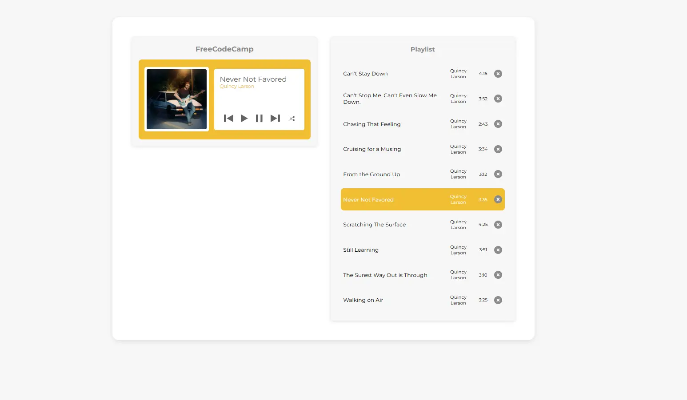
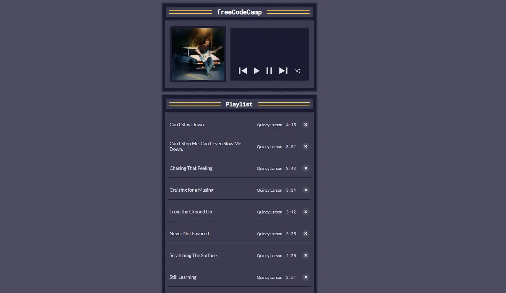

# 🎸 Music Player

A simple and interactive music player built as part of the [FreeCodeCamp JavaScript Algorithms and Data Structures Certification](https://www.freecodecamp.org/learn/javascript-algorithms-and-data-structures-v8/learn-basic-string-and-array-methods-by-building-a-music-player/) and later refactored to React using Vite.
This project represents the evolution from a vanilla JavaScript DOM-based implementation to a declarative React component architecture.

🚀 Live Demo
https://gusavila.github.io/music-player/

##  Project Overview

The Music Player allows users to:
- Navigate through a playlist
- Play and pause songs
- View song details like title and artist
- Understand the use of JavaScript array and string manipulation methods in a real-world example

## 📷 New Version Preview




## 📷 Old Version Preview



## Project Evolution

### Version 1 — Vanilla JavaScript

Built following the FreeCodeCamp project requirements, focusing on:
- Array methods (map, filter, forEach)
- String manipulation
- DOM selection and event listeners
- Direct DOM updates

### Version 2 — React Refactor

The project was fully migrated to React, replacing:
❌ Direct DOM manipulation
❌ Imperative UI updates

With:

✅ Declarative rendering
✅ Component-based architecture
✅ State management using React hooks
✅ Separation of concerns

## 💻 Technologies Used
- **React**
- **Vite** 
- **JavaScript (ES6+)**
- **CSS3**

## Project Structure
   ```bash
   src/
    ├── components/
    │    ├── Player.jsx
    │    └── Playlist.jsx
    ├── data/
    │    └── allSongs.js
    ├── App.jsx
    └── main.jsx
   ```

## 🚀 Getting Started

To run the project locally:

1. Clone this repository:
   ```bash
   git clone https://github.com/your-username/music-player.git

2. Install dependencies:
    ```bash
    npm install
3. Run development server:
   ```bash
   npm run dev

## 📚 Acknowledgments

[FreeCodeCamp](https://www.freecodecamp.org/) for providing the project idea and guidance.
The refactor was done as part of my learning journey into React and modern frontend architecture.
